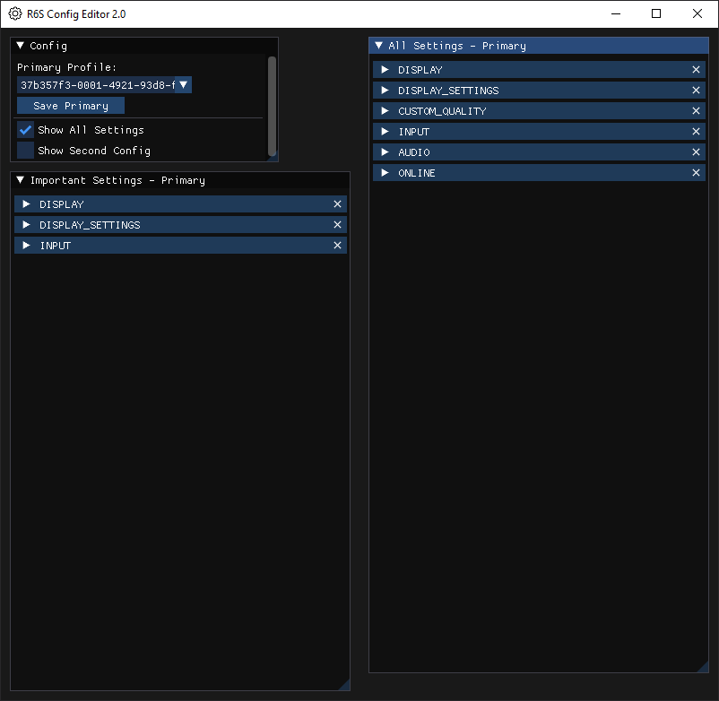

# r6-config-editor

Simple Rainbow Six Siege config editor. This is mostly written by an AI.

# Screenshots


# r6-config-editor



A simple configuration editor for **Rainbow Six Siege**, built with Python and `pyimgui` + `pyglet`. This tool allows you to quickly view and edit both important and full game settings across multiple profiles.

> **Note:** This project was mostly generated and structured by an AI assistant.

---

## Features

* **Primary & Secondary Profiles**: Compare or copy settings between two profiles.
* **Important vs. All Settings**: Toggle between key gameplay/display/input settings and the full list.
* **Live UI**: Smooth 60 FPS rendering in a resizable window.
* **Unified Load/Save**: Single backend handles both partial and full settings.
* **Software Fallback**: Works on systems without a dedicated GPU (via ANGLE or Mesa llvmpipe).

## Screenshot


## Installation

1. Clone the repository:

   ```bash
   git clone https://github.com/yourusername/r6-config-editor.git
   cd r6-config-editor
   ```

2. Install dependencies:

   ```bash
   pip install -r requirements.txt
   ```

3. Run the editor:

   ```bash
   python editor.py
   ```

> **Windows Tip:** If you encounter OpenGL errors on systems without a GPU, set up ANGLE:
>
> ```bat
> set PYGLET_GL_PLATFORM=egl
> ```

## Usage

* Launch the app and choose your **Primary Profile** from the dropdown.
* Toggle **Show All Settings** to reveal every configurable parameter.
* Use **Save Primary** or **Save Second** to write changes back to `GameSettings.ini`.
* To compare, enable the **Secondary Profile** pane.

## Configuration Path

By default, the editor looks for profiles under:

```
~/Documents/My Games/Rainbow Six - Siege
```

On Windows in non-English locales, you may need to point to your actual “Documents” folder. See [migration notes](#migration) for details.

## Migration & Troubleshooting

* **No Profiles Found**: Ensure Rainbow Six Siege has generated `GameSettings.ini` in your Documents folder.
* **OpenGL Errors**: Update GPU drivers or use a software renderer (see **Windows Tip** above).
* **Fallback UI**: If OpenGL is unavailable, the editor can fallback to a Tkinter-based interface (legacy support).

## Assets

* Settings icons by [Ilham Fitrotul Hayat](https://www.flaticon.com/free-icons/settings) (Flaticon)

## Contributing

Feel free to open issues or submit pull requests to add features, fix bugs, or improve UX!

## License

This project is licensed under the MIT License. See [LICENSE](LICENSE) for details.
